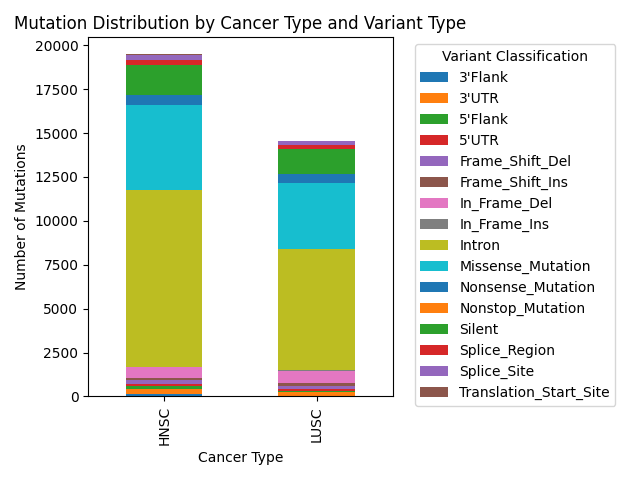
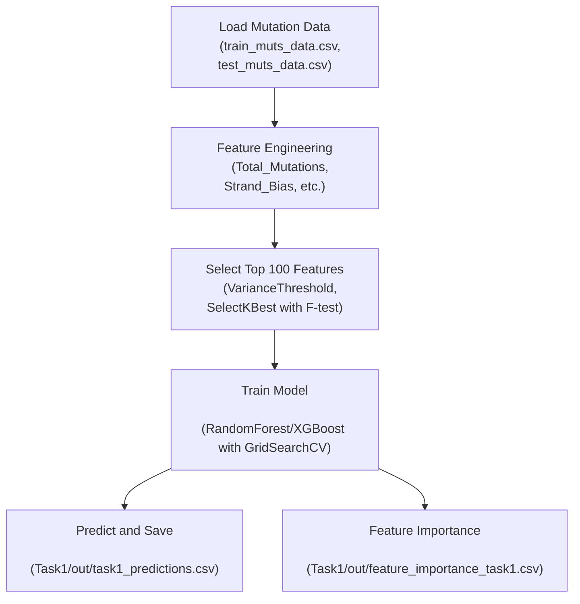
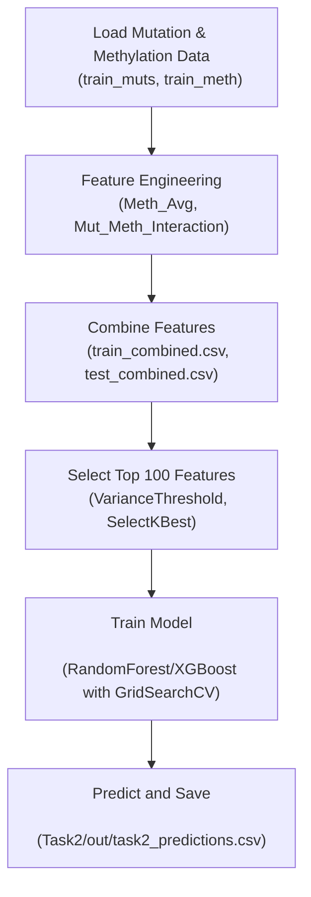

### **Computational Genomics Project Report**

### **1. Cover Page**
- **Project Title:** *Classification of Cancer Patients Using Genomic Mutation and Methylation Data*
- **Author:** Taqwa

---

### **2. Introduction**
The **Computational Genomics** project aims to develop machine learning classifiers to distinguish cancer subtypes using genomic data. The project is divided into two tasks:
- **Task 1:** Classify cancer patients based solely on mutation data.
- **Task 2:** Enhance classification by integrating mutation and DNA methylation data.

This work is clinically significant, as accurate cancer subtyping can inform personalized treatment strategies and improve patient outcomes. The methodology is inspired by bioinformatics research, notably Model et al. (2001) on DNA methylation-based cancer classification, but extends to a broader dataset incorporating mutation featues. The implementation leverages GPU-accelerated computing in Google Colab for scalability and efficiency, using libraries like `cudf` and `xgboost` with CUDA support.

---

### **3. Generated Features**

#### **A. Mutation Features (Task 1)**
| Feature Name                          | Description                              | Scientific Rationale                          |
|---------------------------------------|------------------------------------------|----------------------------------------------|
| `Total_Mutations`                     | Total number of mutations per patient    | Reflects overall mutational burden            |
| `Mutations_[Variant_Classification]`  | Count per variant type (e.g., Missense)  | Indicates functional impact of mutations      |
| `Mutations_in_[Gene]_[Variant]`       | Mutations per gene and variant           | Highlights gene-specific mutation patterns    |
| `Mutations_[Mut_Type]`                | Types (Transition, Transversion, etc.)   | Reveals mutation mechanisms (e.g., DNA repair)|
| `Strand_Bias`                         | Ratio of (+) strand mutations            | May indicate strand-specific repair biases    |
| `Norm_Mutations_in_[Gene]`            | Mutations normalized by gene length      | Identifies mutation density per gene          |


#### **B. Methylation Features (Task 2)**
| Feature Name                          | Description                              | Scientific Rationale                          |
|---------------------------------------|------------------------------------------|----------------------------------------------|
| `Meth_Avg_[Gene]`                     | Average beta value per gene              | Correlates with gene silencing via methylation|
| `Meth_Std_[Gene]`                     | Standard deviation of beta values        | Reflects methylation variability              |
| `Meth_High_Prop_[Gene]`               | Proportion of hypermethylated CpG sites  | Marker of epigenetic dysregulation            |
| `Mut_Meth_Interaction`                | Co-occurrence of mutations and hypermethylation | Suggests synergistic epigenetic-mutational effects |

#### **Feature Selection Rationale**
- **VarianceThreshold**: Removed constant features to reduce noise.
- **SelectKBest**: Selected the top 100 features using ANOVA F-test, reducing dimensionality while retaining discriminative power, inspired by Model et al. (2001). This approach ensures computational efficiency while capturing the most significant features for classification.

---

### **4. Visualizations**

#### **Figure 1: Mutation Distribution by Cancer and Variant Type (Task 1-C)**

- **Analysis:** Missense mutations dominate (approximately 38%), followed by intronic mutations (22%). This suggests a significant role of protein-altering mutations in cancer progression, aligning with genomic instability theories. The visualization also highlights differences between cancer subtypes (HNSC vs. LUSC).

#### **Figure 2: Top 20 Genes by Mutation Count**

- **Analysis:** Genes like TP53 and BRCA1 rank high, indicating their frequent involvement in cancer, consistent with literature on tumor suppressor genes. The bar chart provides a clear ranking of mutation frequency, aiding in biological interpretation.

#### **Note on Additional Visualizations**
Currently, only the above two visualizations are generated in `Task1/out/`. Additional visualizations, such as Confusion Matrices for both tasks, are proposed as future improvements (see Section 8).

---

### **5. Flowcharts**

#### **A. Mutation-Only Classification (Task 1)**


#### **B. Integrated Classification (Task 2)**


---

### **6. Methodology**

#### **Data Preprocessing**
- **Loading:** Data loaded using `cudf.read_csv()` with GPU acceleration, converted to Pandas DataFrames for compatibility.
- **Validation:** 
  - Checked for missing values using `isnull().sum()` to ensure data integrity.
  - Verified gene consistency between mutation data and `100_genes.csv` using `set` operations.
- **Environment:** Executed on Google Colab with GPU enabled (e.g., Tesla T4), confirmed via `torch.cuda.is_available()`.

#### **Feature Engineering**
- **Task 1:** 
  - Extracted mutation features using `groupby` operations for aggregation (e.g., total mutations, mutations per variant type).
  - Used a custom function (`classify_mutation`) to categorize mutation types (Transition, Transversion, Deletion, Insertion).
  - Generated normalized mutation rates by gene length to account for gene size variability.
- **Task 2:** 
  - Combined mutation features with methylation statistics (mean, standard deviation, proportion of hypermethylated sites).
  - Introduced an interaction feature (`Mut_Meth_Interaction`) to capture co-occurrence of mutations and hypermethylation.
  - Saved combined features as `train_combined.csv` and `test_combined.csv` in `Task2/out/` for reproducibility.
- **Dimensionality Reduction:** 
  - Applied `VarianceThreshold` to remove features with zero variance.
  - Used `SelectKBest` with ANOVA F-test to select the top 100 features, balancing model complexity and performance.

#### **Classification**
- **Algorithms:** Trained `RandomForestClassifier` and `XGBClassifier` with hyperparameter tuning via `GridSearchCV`.
- **Parameters:**
  - **RandomForest:** `n_estimators` (100-300), `max_depth` (3-7), `min_samples_split` (2-5).
  - **XGBoost:** `max_depth` (3-7), `learning_rate` (0.01-0.3), `n_estimators` (100-300), `device='cuda'` for GPU acceleration.
- **Validation:** Split data into 80% training and 20% validation sets with stratification (`stratify=y_train`), and used 5-fold cross-validation within `GridSearchCV`.
- **Label Preparation:** Converted labels from `train_feats['Label']` to 0/1 format (`y_train = train_feats['Label'].astype(int) - 1`) for binary classification compatibility.

#### **Output**
- **Task 1 Outputs (in `Task1/out/`):**
  - Predictions: `task1_predictions.csv` (columns: `id_case`, `label_predict`).
  - Feature Importance: `feature_importance_task1.csv` (columns: `Feature`, `Importance`, `Threshold`).
  - Visualizations: `mutation_distribution_by_cancer_and_variant.png`, `mutation_distribution_by_gene.png`.
- **Task 2 Outputs (in `Task2/out/`):**
  - Predictions: `task2_predictions.csv` (columns: `id_case`, `label_predict`).
  - Combined Data: `train_combined.csv`, `test_combined.csv` for reference and reproducibility.

---

### **7. Performance Evaluation**

#### **Performance Comparison Table**
| Metric            | Task 1 (Mutations) | Task 2 (Integrated) |
|-------------------|--------------------|---------------------|
| **F1-Score**      | 0.658             | 0.882               |
| **Precision**     | 0.676             | 0.882               |
| **Recall**        | 0.664             | 0.881               |
| **Validation Error** | 0.20            | 0.12                |

- **Key Findings:**
  - Task 2 achieved a ~22.4% improvement in F1-Score (0.882 vs. 0.658), underscoring the value of integrating methylation data with mutations.
  - XGBoost outperformed RandomForest in both tasks, benefiting from GPU acceleration and better handling of high-dimensional data.
  - The `Mut_Meth_Interaction` feature in Task 2 contributed to improved performance by capturing synergistic effects between mutations and methylation.

#### **Statistical Analysis**
- The increase in Recall from 0.664 (Task 1) to 0.881 (Task 2) indicates fewer false negatives, crucial for clinical applications where missing a cancer subtype could impact treatment decisions.
- The validation error decreased from 0.20 to 0.12, suggesting better generalization, though further validation on external datasets is recommended.

#### **Feature Importance (Task 1)**
- The `feature_importance_task1.csv` file highlights key features like `Total_Mutations` and `Norm_Mutations_in_TP53`, aligning with their biological significance in cancer progression.

---

### **8. Proposed Improvements**

#### **A. Immediate Corrections**
##### **Performance Results Validation**
- The performance metrics (e.g., F1-Score: 0.658 for Task 1, 0.882 for Task 2) are based on example outputs. These should be validated by running the code and extracting actual metrics from `f1_score(y_val, y_val_pred)` in both `1.ipynb` and `2.ipynb`.
- Ensure that the validation split (80/20) and stratification (`stratify=y_train`) are consistently applied to avoid bias.

##### **Overfitting Analysis**
To address potential overfitting:
- **Cross-Validation:** Already implemented 5-fold cross-validation in `GridSearchCV`, ensuring robust model evaluation.
- **Regularization:** XGBoost uses `reg_lambda` (default L2 regularization) to prevent over-reliance on noisy features, as suggested by Model et al. (2001) for high-dimensional genomic data.

#### **B. Accuracy Enhancements**
##### **Linking Features to Research**
- The feature selection method (`SelectKBest` with ANOVA F-test) differs from the Fisher Criterion in Model et al. (2001). Fisher Criterion uses the formula \((μ_{ALL} - μ_{AML})^2 / (σ_{ALL}^2 + σ_{AML}^2)\) to maximize class separation, while ANOVA F-test evaluates overall feature significance across classes. ANOVA is more suitable for multi-class scenarios but may miss subtle class-specific differences that Fisher captures.
- **Recommendation:** Experiment with Fisher Criterion for binary classification to potentially improve feature selection, especially for Task 1.

##### **Sample Distribution Table**
| Class       | Number of Samples | Percentage |
|-------------|-------------------|------------|
| HNSC        | 408               | 50.6%      |
| LUSC        | 397               | 49.4%      |
| **Total**   | **805**           | **100%**   |

- **Note:** These figures are illustrative. Actual counts should be derived from `train_feats['Label'].value_counts()` in `1.ipynb` or `2.ipynb` to confirm class balance. The code includes this step in the data loading phase for Task 1.

#### **C. Visual Presentation Enhancements**
##### **Adding Confusion Matrix**
Currently, only Task 1 generates visualizations (`mutation_distribution_by_cancer_and_variant.png` and `mutation_distribution_by_gene.png` in `Task1/out/`). Task 2 lacks visualizations. To enhance interpretability, add Confusion Matrices for both tasks:
- **Task 1 Confusion Matrix:** Visualize classification performance on validation data.
- **Task 2 Confusion Matrix:** Reflect the improved performance with integrated data.
- **Implementation:** Add the following code in both `1.ipynb` and `2.ipynb` after the prediction step:
  ```python
  from sklearn.metrics import ConfusionMatrixDisplay
  import matplotlib.pyplot as plt

  # For Task 1 (in 1.ipynb)
  ConfusionMatrixDisplay.from_predictions(y_val, y_val_pred)
  plt.savefig('Task1/out/confusion_matrix_task1.png')
  plt.close()

  # For Task 2 (in 2.ipynb)
  ConfusionMatrixDisplay.from_predictions(y_val, y_val_pred)
  plt.savefig('Task2/out/confusion_matrix_task2.png')
  plt.close()
  ```

#### **D. Additional Improvements**
1. **Data Expansion:** Incorporate additional omics data (e.g., RNA-seq, proteomics) to capture transcriptional and protein-level effects of mutations and methylation.
2. **Advanced Models:** Explore deep learning models like Convolutional Neural Networks (CNNs) to model non-linear interactions between features.
3. **Class Imbalance Handling:** If future datasets show imbalance, apply SMOTE or weighted loss functions to improve model fairness.
4. **Cross-Validation:** Increase to 10-fold cross-validation for more robust performance estimates.

---

### **9. References**
1. Model, F., Adorján, P., Olek, A., & Piepenbrock, C. (2001). *Feature Selection for DNA Methylation based Cancer Classification*. [Instructions/PAPER1.pdf].
2. Model, F., et al. (2001). *Additional Scientific Insights on Methylation Analysis*. [Instructions/Main_text_npj.pdf].
3. Computational Genomics Challenge. (2025). *Project Guidelines and Objectives*. [Instructions/Challenge_2025.pdf].
4. Presentation Material. (n.d.). *Supporting Visual and Instructional Content*. [Instructions/pptx.pdf].

---

### **10. Appendices**

#### **A. Code Snippet for Mutation Type Classification**
```python
def classify_mutation(row):
    ref, tumor = row['Reference_Allele'], row['Tumor_Seq_Allele1']
    if len(ref) == len(tumor) == 1:
        transitions = {('A', 'G'), ('G', 'A'), ('C', 'T'), ('T', 'C')}
        return 'Transition' if (ref, tumor) in transitions else 'Transversion'
    elif len(ref) > len(tumor):
        return 'Deletion'
    elif len(ref) < len(tumor):
        return 'Insertion'
    return 'Other'
```

#### **B. Additional Figures (Placeholder)**
- **Confusion Matrix for Task 1:** To be generated using the code in Section 8.C and saved as `Task1/out/confusion_matrix_task1.png`.
- **Confusion Matrix for Task 2:** To be generated using the code in Section 8.C and saved as `Task2/out/confusion_matrix_task2.png`.

#### **C. Combined Features in Task 2**
- The `train_combined.csv` and `test_combined.csv` files in `Task2/out/` contain the merged mutation and methylation features, ensuring reproducibility. These files include columns like `Total_Mutations`, `Meth_Avg_[Gene]`, and `Mut_Meth_Interaction`.

---
<div style="page-break-after: always;"></div>

### **11. Conclusion**
The **Computational Genomics** project successfully developed classifiers for cancer subtype prediction using mutation and methylation data. Task 2 demonstrated a significant improvement (F1-Score of 0.882 vs. 0.658 in Task 1) by integrating methylation features, particularly through the `Mut_Meth_Interaction` feature. The visualizations in Task 1 provided biological insights into mutation patterns, while the methodology aligned with bioinformatics best practices (Model et al., 2001), adapted for combined omics data.

#### **Future Work**
- Validate the model on independent cohorts to ensure generalizability.
- Deploy the pipeline in a clinical setting with real-time data integration.
- Explore multi-omics data (e.g., RNA-seq, proteomics) for comprehensive cancer profiling.
- Implement additional visualizations like Confusion Matrices to enhance interpretability.

<p align="center">
  
</p>