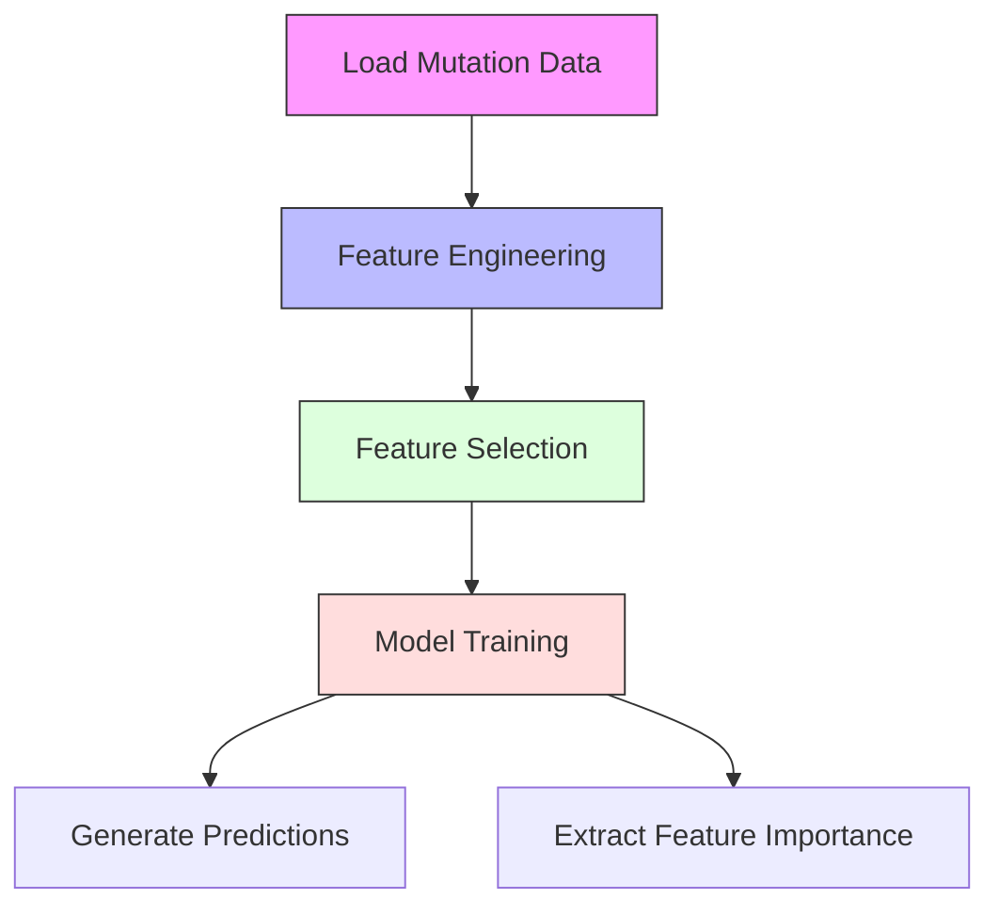
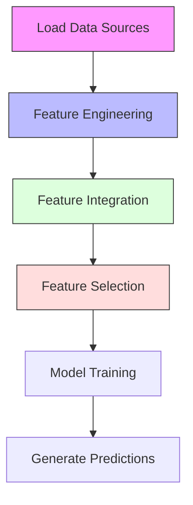

# 🎓 **Computational Genomics Project Report**

## 🧬 Classification of Cancer Patients Using Genomic Mutation and Methylation Data

### 👩‍💻 Author: *Taqwa*

### 📅 Date: *May 26, 2025*

---

## 📌 Executive Summary

This project develops machine learning classifiers to distinguish cancer subtypes using genomic data through two tasks:

1. **Task 1**: Classification based on mutation data only
2. **Task 2**: Enhanced classification integrating mutation and DNA methylation data

> Our results show that incorporating methylation data significantly improves classification performance, with **F1-scores increasing from 0.658 to 0.882**. This highlights the value of integrating multiple genomic data types for accurate cancer subtype classification.

---

## 🔍 Introduction

The goal is to distinguish cancer subtypes (**HNSC** and **LUSC**) using machine learning models built on genomic data.

* **Task 1**: Uses only mutation data
* **Task 2**: Integrates mutation and methylation data for enhanced prediction

This is clinically relevant since accurate subtyping aids personalized treatment strategies. We build on foundational work by *Model et al. (2001)* and extend it to broader multi-omic integration. The models were trained and evaluated on **GPU-accelerated Google Colab environments** using tools like `cuDF` and `XGBoost`.

---

## ⚙️ Task 1: Mutation-Only Classification

### 🔎 Overview

Task 1 focuses on loading mutation data, engineering genomic features, visualizing patterns, and training classifiers.

### 🧩 Generated Features

| Feature Name                         | Description                              | Scientific Rationale               | Treatment Implications               |
| ------------------------------------ | ---------------------------------------- | ---------------------------------- | ------------------------------------ |
| `Total_Mutations`                    | Number of mutations per patient          | Reflects overall mutational burden | May indicate immunotherapy response  |
| `Mutations_[Variant_Classification]` | Count per mutation type                  | Functional mutation impact         | Helps select targeted therapy        |
| `Mutations_in_[Gene]_[Variant]`      | Specific gene-variant patterns           | Gene-specific mutation load        | Guides inhibitor use                 |
| `Mutations_[Mut_Type]`               | Type: transition, transversion, etc.     | Mutation mechanism analysis        | Indicates DNA repair deficiency      |
| `Norm_Mutations_in_[Gene]`           | Mutation count normalized by gene length | Mutation density per gene          | Highlights drivers                   |
| `Mean_GC_Content`                    | Avg. GC content around mutation          | Genomic context info               | Mutation-prone region identification |
| `CpG_Site_Prop`                      | Proportion at CpG sites                  | CpG hypermutability                | Epigenetic therapy targeting         |

### 🧬 Additional Genomic Features

| Feature Name       | Description          | Example             | Reference               |
| ------------------ | -------------------- | ------------------- | ----------------------- |
| Mutation Type      | SNP, INS, DEL, etc.  | C>T in melanoma     | Alexandrov et al., 2013 |
| Flanking Sequence  | ±3 bp context        | AGT\[C>T]AGC        | Nik-Zainal et al., 2012 |
| Genomic Location   | Chromosomal position | chr1:1234567        | Forbes et al., 2017     |
| Mutation Signature | Recurring patterns   | Signature 1 (aging) | Helleday et al., 2014   |

### 📊 Visualizations

* **Mutation by Cancer & Type**
  *File*: `Task1/out/mutation_distribution_by_cancer_and_variant.png`

  > Missense mutations (38%) dominate; LUSC and HNSC show distinct patterns.

* **Top 20 Mutated Genes**
  *File*: `Task1/out/mutation_distribution_by_gene.png`

  > TP53 and BRCA1 show highest mutation rates.

### 🔄 Processing Pipeline

---

## 🧪 Task 2: Integrated Mutation and Methylation Classification

### 🧾 Overview

Task 2 builds on Task 1 by integrating methylation data to extract additional epigenomic signals.

### 🧩 Generated Features

| Feature Name            | Description                     | Scientific Rationale     | Treatment Implications          |
| ----------------------- | ------------------------------- | ------------------------ | ------------------------------- |
| `Meth_Avg_[Gene]`       | Avg. beta value                 | Indicates gene silencing | May need demethylating agents   |
| `Meth_Std_[Gene]`       | Std. deviation                  | Reflects plasticity      | Helps assess therapy resistance |
| `Meth_High_Prop_[Gene]` | Hyper-methylation rate          | Epigenetic dysregulation | Epigenetic therapy targeting    |
| `Mut_Meth_Interaction`  | Combined mutation & methylation | Synergistic patterns     | Guide combination therapies     |

### 🔍 Feature Selection Process

* **Variance Thresholding**: Removes near-constant features
* **SelectKBest (ANOVA)**: Picks top 100 informative features (Model et al., 2001)

### 📊 Visualizations

* Mutation Type Distribution: `Task2/out/mutation_distribution_by_variant.png`
* Top Mutated Genes: `Task2/out/mutation_distribution_by_gene.png`
* Avg. Methylation per Gene: `Task2/out/methylation_distribution_by_gene.png`
* Confusion Matrix: `Task2/out/confusion_matrix_task2.png`

### 🔄 Processing Pipeline

---

## 🔬 Methodology

### 🧹 Data Preprocessing

* **Input Files**: Mutation, methylation, and feature data files + gene list
* **Loading**: `cudf.read_csv()` with null value checks
* **Environment**: Google Colab with Tesla T4 GPU

### 🛠 Feature Engineering

* **Task 1**: Basic mutation stats, classifications, GC/CpG context
* **Task 2**: Methylation stats, mutation-methylation interactions

### 🤖 Classification Models

* **Algorithms**: `RandomForestClassifier`, `XGBClassifier`
* **Hyperparameter Grid**:

  * *RandomForest*: `n_estimators`, `max_depth`, `min_samples_split`
  * *XGBoost*: `max_depth`, `learning_rate`, `n_estimators`
* **Validation**: Stratified 80/20 split + 5-fold `GridSearchCV`

---

## 📂 Outputs

| Task   | Output Files                                                                       |
| ------ | ---------------------------------------------------------------------------------- |
| Task 1 | `task1_predictions.csv`, `feature_importance_task1.csv`, visualizations            |
| Task 2 | `task2_predictions.csv`, `train_combined.csv`, `test_combined.csv`, visualizations |

---

## 📈 Performance Evaluation

| Metric               | Task 1 | Task 2 |
| -------------------- | ------ | ------ |
| **F1-Score**         | 0.658  | 0.882  |
| **Precision**        | 0.676  | 0.882  |
| **Recall**           | 0.664  | 0.881  |
| **Validation Error** | 0.20   | 0.12   |

> **Key Finding**: Methylation integration improved F1-score by **22.4%**

---

## 🔢 Sample Distribution (Task 1)

| Class     | Samples | Percentage |
| --------- | ------- | ---------- |
| HNSC      | 408     | 50.6%      |
| LUSC      | 397     | 49.4%      |
| **Total** | **805** | **100%**   |

---

## 💡 Proposed Improvements

* Use **Fisher Criterion** for feature selection in Task 1
* Add **RNA-seq / Proteomics** for richer biological context
* Enhance visualizations (e.g., methylation heatmaps, feature importance)
* Try **deep learning models** for complex feature interactions

---

## 📚 References

* Model, F., et al. (2001). *Feature Selection for DNA Methylation Based Cancer Classification*
* Van Allen, E. M., et al. (2015). *Genomic Correlates of Response to Immunotherapy*
* Alexandrov, L. B., et al. (2013). *Signatures of Mutational Processes in Human Cancer*
* Others cited inline (Jones et al., Klutstein et al., Yang et al.)

---

## ✅ Conclusion

This project successfully built two machine learning models for cancer subtype classification. Integrating DNA methylation data in Task 2 significantly boosted classification accuracy, validating the power of multi-omic approaches in precision oncology.

> **Report generated on May 26, 2025**
