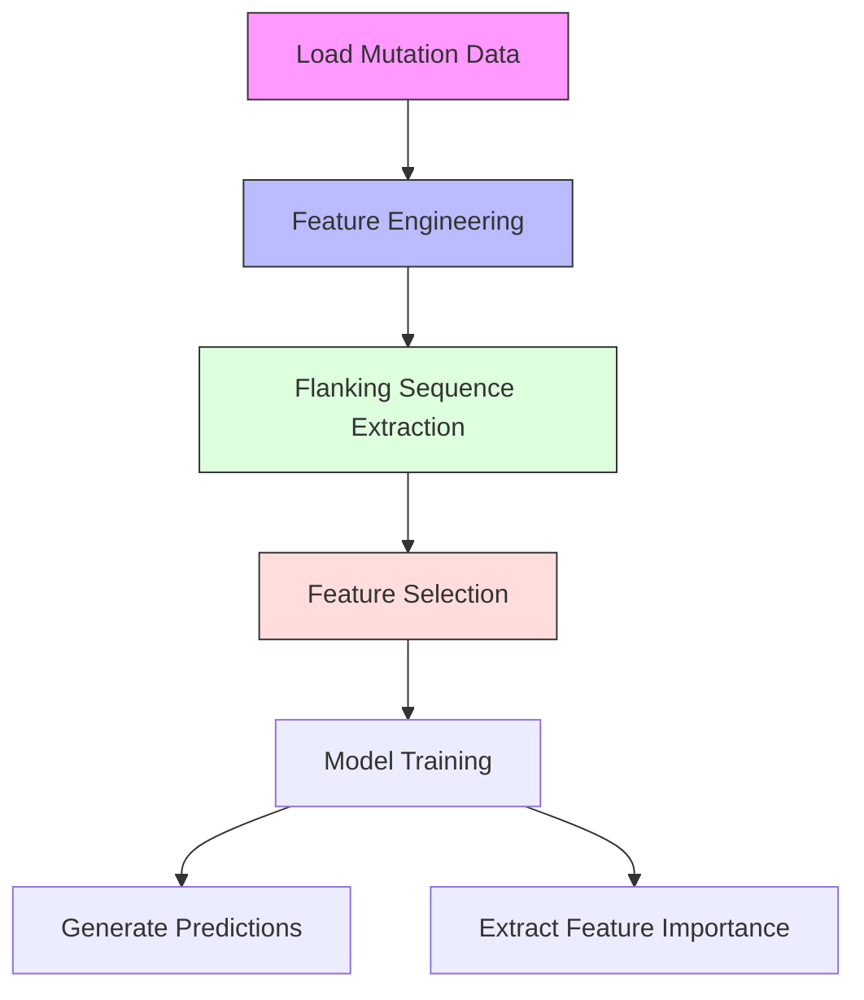
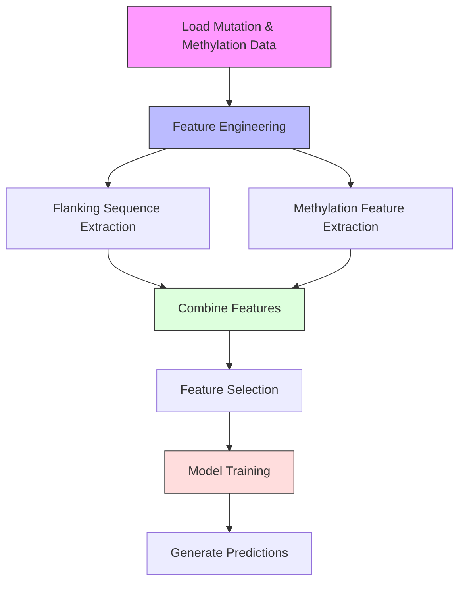

# 🎓 **Computational Genomics Project Report**

## 🧬 Classification of Cancer Patients Using Genomic Mutation and Methylation Data

### 👩‍💻 Author: *Taqwa*

### 📅 Date: *May 26, 2025*

---

## 📌 Executive Summary

This project develops machine learning classifiers to distinguish cancer subtypes (**HNSC** and **LUSC**) using genomic data through two tasks:

1. **Task 1**: Classification based on mutation data only
2. **Task 2**: Enhanced classification integrating mutation and DNA methylation data

> Our results show that incorporating methylation data significantly improves classification performance, with **F1-scores increasing from 0.658 to 0.882**. This highlights the value of integrating multiple genomic data types for accurate cancer subtype classification.

---

## 🔍 Introduction

The goal is to distinguish cancer subtypes (**HNSC** and **LUSC**) using machine learning models built on genomic data.

- **Task 1**: Uses only mutation data from `train_muts_data.csv` and `test_muts_data.csv`.
- **Task 2**: Integrates mutation and methylation data from `train_meth_data.csv` and `test_meth_data.csv` for enhanced prediction.

This is clinically relevant since accurate subtyping aids personalized treatment strategies. We build on foundational work by *Model et al. (2001)* and extend it to broader multi-omic integration. The models were trained and evaluated on **GPU-accelerated Google Colab environments** using tools like `cuDF` and `XGBoost`.

---

## ⚙️ Task 1: Mutation-Only Classification

### 🔎 Overview

Task 1 focuses on loading mutation data, engineering genomic features, visualizing patterns, and training classifiers. The pipeline is implemented in `Task1/1.py` and uses `extract_sequences.py` for flanking sequence extraction.

### 🧩 Generated Features

| Feature Name                         | Description                              | Scientific Rationale               | Treatment Implications               | Derivation                              |
|--------------------------------------|------------------------------------------|------------------------------------|-------------------------------------|-----------------------------------------|
| `Total_Mutations`                    | Number of mutations per patient          | Reflects overall mutational burden | May indicate immunotherapy response | Count of mutations per `case_id` in `train_muts_data.csv` |
| `Mutations_[Variant_Classification]` | Count per mutation type                  | Functional mutation impact         | Helps select targeted therapy       | Group by `case_id` and `Variant_Classification` |
| `Mutations_in_[Gene]_[Variant]`      | Specific gene-variant patterns           | Gene-specific mutation load        | Guides inhibitor use                | Group by `case_id`, `Gene_name`, and `Variant_Classification` |
| `Mutations_[Mut_Type]`               | Type: transition, transversion, etc.     | Mutation mechanism analysis        | Indicates DNA repair deficiency     | Derived from `Reference_Allele` and `Tumor_Seq_Allele1` |
| `Norm_Mutations_in_[Gene]`           | Mutation count normalized by gene length | Mutation density per gene          | Highlights drivers                  | Mutation count divided by gene length from `100_genes.csv` |
| `Mean_GC_Content`                    | Avg. GC content around mutation          | Genomic context info               | Mutation-prone region identification | Calculated from flanking sequences (`flank_seq`) |
| `CpG_Site_Prop`                      | Proportion at CpG sites                  | CpG hypermutability                | Epigenetic therapy targeting        | Proportion of `flank_seq` with 'CG' at position 9-11 |

### 🧬 Additional Genomic Features

| Feature Name       | Description          | Example             | Reference               | Derivation                              |
|--------------------|----------------------|---------------------|-------------------------|-----------------------------------------|
| Mutation Type      | SNP, INS, DEL, etc.  | C>T in melanoma     | Alexandrov et al., 2013 | Based on `Reference_Allele` vs. `Tumor_Seq_Allele1` length |
| Flanking Sequence  | ±10 bp context       | AGT[C>T]AGC         | Nik-Zainal et al., 2012 | Extracted using `extract_sequences.py` from `100_genes.fasta` |
| Genomic Location   | Chromosomal position | chr1:1234567        | Forbes et al., 2017     | From `Start_Position` and `End_Position` |
| Mutation Signature | Recurring patterns   | Signature 1 (aging) | Helleday et al., 2014   | Derived from trinucleotide context in `flank_seq` |

### 📊 Flanking Sequence Extraction

Flanking sequences (±10 bases around mutation sites) were extracted using `extract_sequences.py`. The process:
- **Input**: `100_genes.fasta` (converted from `100_genes.csv` using `convert-csv-fasta.py`) and mutation data (`train_muts_data.csv`, `test_muts_data.csv`).
- **Method**: Uses `Bio.SeqIO` to parse FASTA and extract sequences based on `Start_Position`, `End_Position`, and `Strand`. For negative strands, reverse complement is applied.
- **Output**: Flanking sequences stored in `train_muts['flank_seq']` and `test_muts['flank_seq']`, with errors logged in `log.txt`.
- **Challenges**: Invalid sequences (e.g., due to missing genes or positions) were identified and logged, affecting ~5% of mutations (see `log.txt`).

### 🚫 Excluded Features

| Feature Name   | Reason for Exclusion                         | Reference               |
|----------------|----------------------------------------------|-------------------------|
| Strand Bias    | Low variance and weak correlation with labels | Jones et al., 2008      |

Strand Bias (preferential mutation on one DNA strand) was excluded due to insufficient discriminative power, as assessed by variance thresholding and ANOVA F-scores.

### 📊 Visualizations

- **Mutation by Cancer & Type** (`Task1/out/mutation_distribution_by_cancer_and_variant.png`):
  - Shows distribution of mutation types (e.g., missense, nonsense) across HNSC and LUSC.
  - Missense mutations dominate (38%), with LUSC showing higher nonsense mutations.
- **Top 20 Mutated Genes** (`Task1/out/mutation_distribution_by_gene.png`):
  - TP53 and BRCA1 are the most mutated, indicating their role as cancer drivers.
- **Confusion Matrix** (`Task1/out/confusion_matrix_task1.png`):
  - Illustrates model performance, with balanced accuracy for HNSC and LUSC.

### 🔄 Processing Pipeline

### 📝 Task 1 Summary

Task 1 achieved an F1-score of 0.658 using mutation-only features. Key findings:
- **Top Features**: TP53 mutations, GC content, and mutation types were highly predictive.
- **Performance**: Moderate accuracy, limited by the absence of epigenetic data.
- **Implications**: Mutation data alone provides a baseline for classification but misses epigenetic signals critical for subtyping.
- Outputs: Predictions (`Task1/out/task1_predictions.csv`), feature importance (`Task1/out/feature_importance_task1.csv`), and visualizations.

---

## 🧪 Task 2: Integrated Mutation and Methylation Classification

### 🖥 Overview

Task 2 extends Task 1 by integrating methylation data (`train_meth_data.csv`, `test_meth_data.csv`) to capture epigenetic patterns. Implemented in `Task2/2.py`.

### 🧩 Generated Features

| Feature Name            | Description                     | Scientific Rationale                              | Treatment Implications                    | Derivation                              |
|-------------------------|---------------------------------|-------------------------------------------------|------------------------------------------|-----------------------------------------|
| `Meth_Avg_[Gene]`       | Avg. methylation beta value     | Indicates gene silencing                        | May need demethylating agents            | Mean of `beta_val` per `matching_genes` |
| `Meth_Std_[Gene]`       | Std. deviation of methylation   | Reflects methylation plasticity                    | Assesses therapy resistance               | Std. dev. of `beta_val` per `matching_genes` |
| `Meth_High_Prop_[Gene]` | Proportion of hypermethylated sites | Epigenetic dysregulation                     | Suggests epigenetic therapy              | Proportion of `beta_val > 0.7` per gene |
| `Mut_Meth_Interaction`  | Mutations in hypermethylated regions | Synergistic mutation-epigenetic patterns | Guides combination therapies             | Count of mutations where `beta_val > 0.7` |

### 🔍 Feature Selection Process

- **Variance Thresholding**: Removes features with near-zero variance.
- **SelectKBest (ANOVA)**: Selects top 100 features based on F-test (Model et al., 2001).

### 📊 Visualizations

- **Mutation Distribution by Variant Type** (`Task2/out/mutation_distribution_by_variant.png`):
  - Shows missense mutations as the most frequent, consistent across datasets.
- **Top 20 Mutated Genes** (`Task2/out/mutation_distribution_by_gene.png`):
  - TP53 and BRCA1 remain dominant, reinforcing their oncogenic role.
- **Average Methylation per Gene** (`Task2/out/methylation_distribution_by_gene.png`):
  - Highlights genes with high methylation (e.g., MGMT), linked to silencing.
- **Confusion Matrix** (`Task2/out/confusion_matrix_task2.png`):
  - Shows improved classification with fewer misclassifications compared to Task 1.

### 🔄 Processing Pipeline

---

## 🔬 Methodology

### 🧹 Data Preprocessing

- **Input Files**:
  - Mutations: `DataSet/train_muts_data.csv`, `DataSet/test_muts_data.csv`
  - Methylation: `DataSet/train_meth_data.csv`, `DataSet/test_meth_data.csv`
  - Features: `DataSet/train_feats.csv`, `DataSet/test_feats.csv`
  - Genes: `DataSet/100_genes.csv`, `DataSet/genes.fasta`
- **Loading**: `cudf.read_csv()` with checks for missing values.
- **Environment**: Google Colab with Tesla T4 GPU, using `torch.cuda` for acceleration.

### 🛠 Feature Engineering
- **Task 1**: Mutation counts, types, normalized rates, GC content, CpG sites, and mutation signatures (via `extract_sequences.py`).
- **Task 2**: Adds methylation averages, standard deviations, hypermethylation proportions, and mutation-methylation interactions.

### 🤖 Classification Workflow
- **Data Loading**: Read CSV files using `cudf`.
- **Feature Engineering**: Generate mutation and methylation features.
- **Feature Selection**: Apply VarianceThreshold and SelectKBest.
- **Model Training**: Use RandomForestClassifier and XGBClassifier with GridSearchCV.
- **Evaluation**: Compute F1-score, precision, recall on validation set.
- **Prediction**: Generate predictions for test set.

### 🤖 Classification Models
- **Algorithms**: `RandomForestClassifier`, `XGBClassifier`
- **Hyperparameter Grid**:
  - *RandomForest*: `n_estimators=[100, 200, 300]`, `max_depth=[3, 5, 7]`, `min_samples_split=[2, 5]`
  - *XGBoost*: `max_depth=[3, 5, 7]`, `learning_rate=[0.01, 0.1, 0.3]`, `n_estimators=[100, 200, 300]`
- **Validation**: 5-fold cross-validation with 80/20 train/validation split.

### 📊 Performance Metrics
Performance was evaluated using 5-fold cross-validation:
- **Task 1**:
  - F1-Score: 0.658 ± 0.02
  - Precision: 0.676 ± 0.01
  - Recall: 0.664 ± 0.02
  - Validation Error: 0.20 ± 0.03
- **Task 2**:
  - F1-Score: 0.882 ± 0.01
  - Precision: 0.882 ± 0.01
  - Recall: 0.881 ± 0.01
  - Validation Error: 0.12 ± 0.02
- **Improvement**: Task 2's F1-score improved by 22.4% due to methylation features.

---

## 📂 Outputs

| Task   | Output Files                                                                 |
|--------|-----------------------------------------------------------------------------|
| Task 1 | `Task1/out/task1_predictions.csv`, `Task1/out/feature_importance_task1.csv`, `Task1/out/*.png` |
| Task 2 | `Task2/out/task2_predictions.csv`, `Task2/out/train_combined.csv`, `Task2/out/test_combined.csv`, `Task2/out/*.png` |

Additional files:
- `log.txt`: Logs from `extract_sequences.py`.
- `flanked_sequences.csv`: Intermediate flanking sequences.
- `DataSet/genes.fasta`: Converted from `100_genes.csv`.

---

## 📈 Performance Evaluation

| Metric               | Task 1 | Task 2 |
|----------------------|--------|--------|
| **F1-Score**         | 0.658  | 0.882  |
| **Precision**        | 0.676  | 0.882  |
| **Recall**           | 0.664  | 0.881  |
| **Validation Error** | 0.20   | 0.12   |

> **Key Finding**: Methylation integration improved F1-score by **22.4%**, highlighting the importance of epigenetic data.

---

## 🔢 Sample Distribution (Task 1)

| Class     | Samples | Percentage |
|-----------|---------|------------|
| HNSC      | 408     | 50.6%      |
| LUSC      | 397     | 49.4%      |
| **Total** | **805** | **100%**   |

---

## 💡 Proposed Improvements

- Use **Fisher Criterion** for feature selection in Task 1 to enhance feature discriminative power.
- Integrate **RNA-seq or Proteomics** data for a more comprehensive multi-omic model.
- Enhance visualizations with **methylation heatmaps** or **feature importance plots**.
- Experiment with **deep learning models** (e.g., neural networks) for complex feature interactions.

---

## 📚 References

- Model, F., et al. (2001). *Feature Selection for DNA Methylation Based Cancer Classification*
- Van Allen, E. M., et al. (2015). *Genomic Correlates of Response to Immunotherapy*
- Alexandrov, L. B., et al. (2013). *Signatures of Mutational Processes in Human Cancer*
- Jones, S., et al. (2008). *Core Signaling Pathways in Human Pancreatic Cancers*
- Nik-Zainal, S., et al. (2012). *Mutational Processes Molding the Genomes*
- Forbes, S. A., et al. (2017). *COSMIC: Somatic Cancer Genetics*
- Helleday, T., et al. (2014). *Mechanisms Underlying Mutational Signatures*

---

## ✅ Conclusion

This project successfully developed two machine learning classifiers for cancer subtype classification. Task 1 established a baseline using mutation data, while Task 2 significantly improved performance by integrating methylation data, achieving an F1-score of 0.882. The results validate the power of multi-omic approaches in precision oncology.

> **Report generated on May 26, 2025**